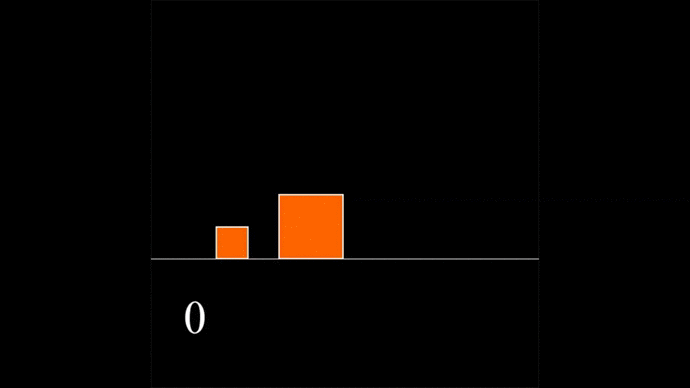

# Colliding Boxes

**Pi** upto 10 decimal places - **3.1415926535**  

| Number of digits of Pi| Ratio of mass of two blocks| Number of Collisions | Speed | Time Steps |  
| --- | --- | --- | --- | --- |
| 1 | 1 or 100^0 | 3 | 0.1 | 1 |  
| 2 | 100 or 100^1| 31 | 0.1 | 1 |  
| 3 | 100^2 | 314 | 0.1 | 1 |  
| 4 | 100^3 | 3141 | 0.1 | 10 |  
| 5 | 100^4 | 31415 | 0.1 | 50 |  
| 6 | 100^5 | 314159 | 1 | 1000 |  

# Gameplay
  

# How to play  
* Configure the digits, speed and time steps from the table given above.  
* Press Space to play.
